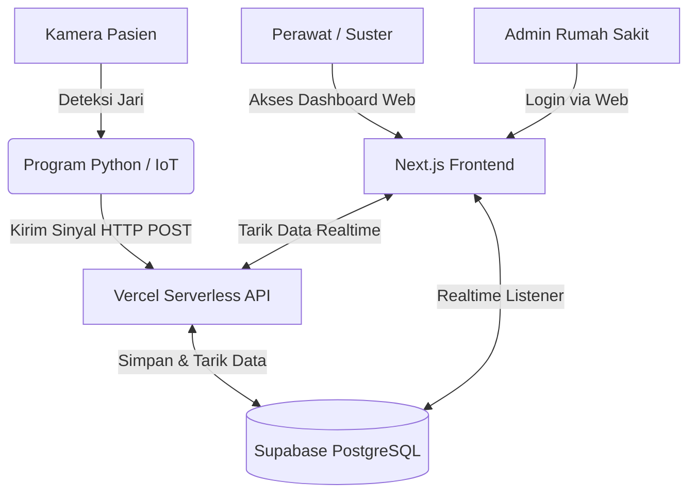

# Arsitektur & Kebutuhan Sistem SMADER

Dokumen ini merangkum rancangan arsitektur sistem ideal untuk pengembangan lanjutan aplikasi **SMADER (Smart Patient Movement Detector)**, mengusung konsep modern *Serverless* dan pemisahan peran (*Role-Based Access*).

---

## 🏗️ 1. Gambaran Arsitektur Sistem (Overview)

Sistem akan beroperasi dengan alur data sebagai berikut:

---

## 🛠️ 2. Technology Stack (Teknologi yang Digunakan)

### A. Perangkat IoT / Titik Pasien (Edge Device)
- **Bahasa**: Python 3.11 (Conda Environment)
- **AI Engine**: Google MediaPipe (Tasks API) & OpenCV
- **Tugas**: Melakukan *tracking* jari tangan, menghitung jumlah jari, lalu melakukan "tembakan" *HTTP Request* ke server Vercel.

### B. Backend & Frontend Terpadu (Monorepo)
- **Framework**: Next.js (React)
- **Hosting / Server**: Vercel
- **Tugas**: 
  1. Menyiapkan *API Endpoint* (misal: `/api/signals`) untuk menerima "tembakan" dari Python.
  2. Menyediakan *website* (Frontend) bagi suster dan admin.

### C. Database & Realtime Engine
- **Provider**: Supabase (PostgreSQL)
- **Tugas**: Menyimpan seluruh catatan (*logs*) panggilan pasien, daftar kamar, dan daftar tenaga medis. Mengirimkan sinyal balik (*realtime websocket*) ke *dashboard* suster jika ada data baru masuk tanpa perlu *refresh*.

---

## 🗂️ 3. Susunan Layanan Aplikasi (Service Structure)

Aplikasi Web (*Frontend* Next.js) akan dibagi menjadi 3 zona utama:

### Zona 1: API Route (Pintu Masuk Python)
*   **Endpoint**: `POST /api/signals`
*   **Fungsi**: Menerima data `{ ruang: "102", kode: 4, timestamp: "..." }`. Setelah diterima, API ini akan menulis (*insert*) ke tabel Supabase.

### Zona 2: Nurse Station (Dashboard Suster)
*   **URL**: `/` atau `/dashboard`
*   **Fungsi**: Layar yang menyala 24/7 di meja perawat.
*   **Fitur**: 
    *   Tabel dan peringatan visual (*alert*) *realtime* jika ada kode masuk.
    *   Suster dapat menekan tombol "Selesai/Tangani" agar peringatan berhenti berbunyi.

### Zona 3: Admin Panel (Khusus Manajemen)
*   **URL**: `/admin`
*   **Fungsi**: Portal khusus kepala rumah sakit atau petugas IT.
*   **Fitur**:
    *   Memerlukan autentikasi (Login Email & Password).
    *   **Manage Kamar**: Menambah/Mengubah ID Kamar & Nama Pasien.
    *   **Manage Kode**: Mendefinisikan arti "Kode 1" sampai "Kode 4".
    *   **Manage Akun**: Menambah akses suster baru.

---

## 📊 4. Kebutuhan Struktur Database (Ideal Schema)

Di dalam Supabase, idealnya kita membutuhkan tabel-tabel berikut:

> [!NOTE]  
> Ini adalah gambaran struktur tabel relasional standar.

| Nama Tabel | Deskripsi & Kolom Utama |
| :--- | :--- |
| `rooms` | Berisi data ruangan fisik.  *(id, room_number, current_patient_name, status)* |
| `signals` | Log panggilan/sinyal yang masuk dari Python.  *(id, room_id, code_number, created_at, is_handled, handled_by)* |
| `users` | Kumpulan akses (*Auth*).  *(id, email, role: 'nurse' atau 'admin', name)* |
| `codes` | Kamus arti dari kode jari.  *(id, finger_count, meaning, urgency_level)* |

---

## 🚀 5. Langkah Selanjutnya (Next Steps)

Jika Anda ingin merealisasikan arsitektur ini, inilah urutan kerjanya:
1. **Buat Akun Supabase**: Daftar di supabase.com, buat *project* kosong, lalu salin URL dan *API Key*-nya.
2. **Inisialisasi Next.js**: Kita men-generate kerangka *project* Next.js (`npx create-next-app`).
3. **Bangun API**: Menulis kode untuk mengkoneksikan Next.js dengan Supabase, lalu menyiapkan *endpoint* untuk Python.
4. **Bangun UI**: Memindahkan desain `index.html` lama menjadi komponen React di Next.js.
5. **Ubah URL Python**: Memperbarui `URL_SERVER` di `final.py` menjadi URL baru milik Vercel/Supabase.
